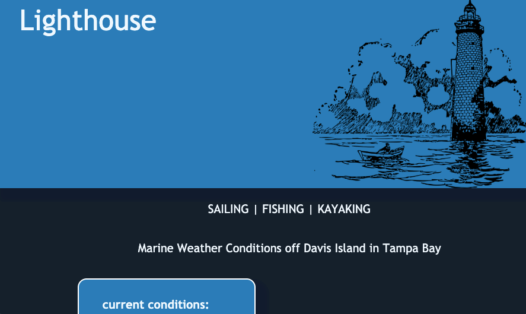
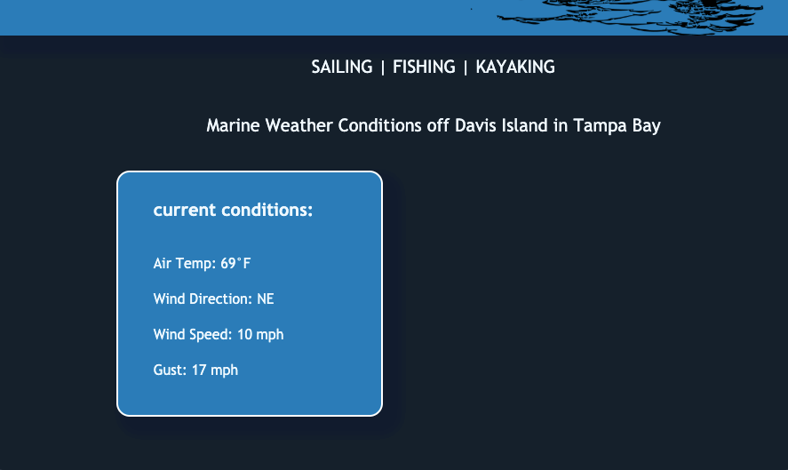
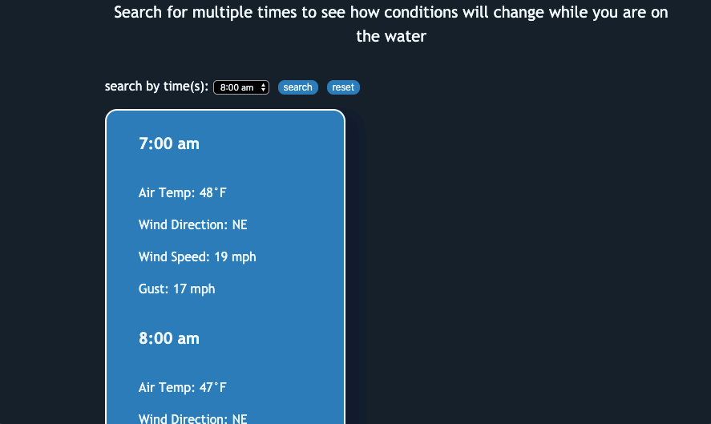

# Lighthouse

### Live Demo
(https://challey17.github.io/LightHouse/)
### Summary

A site for searching marine weather conditions in the Tampa Bay.  Current conditions are displayed on page load. The user can search for conditions at multiple times throughout the day in order to plan their trip on the water. Ideal for sailing, fishing and watersports.

### Screenshots

 

 

 

### Built With
* HTML/CSS
* JavaScript
* jQuery
* [StormGlass API](https://stormglass.io/)
  
### Acknowledgements
* Stephen Hall (Doc Hall), programming yoda